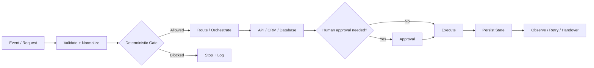

# VAREVANT

**Technical execution for automation, backend systems, and bounded AI agents.**

VAREVANT works with businesses and agencies that already know what needs to improve but need a reliable technical layer to turn that requirement into a working system.

This repository is the public-facing engineering surface behind [varevant.com](https://varevant.com). It intentionally shows the delivery approach, selected work, architecture patterns, and public-safe proof without exposing private client data, credentials, production secrets, or confidential workflow exports.

## What we build

- Workflow and pipeline automation
- CRM, API, webhook, and database integrations
- Internal tools and operational dashboards
- Backend orchestration and system-to-system workflows
- AI agents with explicit tools, permissions, and approval boundaries
- White-label technical execution for agencies
- Production QA, documentation, and handover

Technology is treated as the delivery mechanism, not the outcome. A project starts with the current process, the operational friction, and the decision or handoff that is failing.

## Public proof

### 1. VAREVANT Revenue Operations System

An internal system built and operated by VAREVANT to manage lead flow, routing, follow-up, pipeline state, and operating visibility.

Public artifacts in this repository:

- [`assets/varevant-command-center.png`](assets/varevant-command-center.png) — command-center interface
- [`assets/varevant-workflow.png`](assets/varevant-workflow.png) — workflow architecture visual
- [`index.html`](index.html) — current public product/service surface

This is presented as **internal engineering proof**, not as a third-party client case study.

### 2. WellnessHub Command Center

A self-built client-management/product system used to demonstrate how multiple operational views can be consolidated into one interface: sales tracking, order state, client history, and product performance.

Public artifact:

- [`assets/wellnesshub-command-center.png`](assets/wellnesshub-command-center.png)

This is also presented as a self-built system, not as a fabricated client case study.

### 3. BIMMCA Intelligence

A separate public repository for an AI Authority Intelligence dashboard connected to Supabase and fed by a VAREVANT n8n monitoring workflow.

- [naraya07pedro-spec/bimmca-intelligence](https://github.com/naraya07pedro-spec/bimmca-intelligence)

The public dashboard layer includes competitive authority metrics, strategic gaps, evidence views, and sampled AI-recommendation monitoring. Private automation credentials and backend administration access are not published.

## How we design systems

A typical implementation is structured around a controlled flow rather than a collection of disconnected automations:



Hard gates, permissions, suppression rules, deduplication, and irreversible actions should be deterministic. LLMs are used where language interpretation or bounded judgment is useful; they are not used to invent source data or bypass system controls.

## Delivery standard

The public delivery standard is documented here:

- [`docs/SELECTED-WORK.md`](docs/SELECTED-WORK.md) — what the public proof actually demonstrates
- [`docs/DELIVERY-MODEL.md`](docs/DELIVERY-MODEL.md) — how direct and white-label engagements are structured
- [`docs/PRODUCTION-SAFETY.md`](docs/PRODUCTION-SAFETY.md) — safeguards used when a workflow moves toward production

## White-label execution

For agencies, VAREVANT can work behind the scenes on an agreed technical scope while the agency keeps the end-client relationship.

Typical fit:

- the agency has already won or scoped the business problem;
- the work needs custom automation, integration, backend, or AI implementation;
- hiring permanent technical capacity would be inefficient for the scope;
- delivery ownership, communication boundaries, QA, and handover need to be explicit.

More detail: [varevant.com/white-label-ai-automation](https://varevant.com/white-label-ai-automation/)

## Public / private boundary

Not everything that proves engineering quality should be public.

This repository does **not** publish:

- client credentials or API secrets;
- service-role/database administration keys;
- personal or confidential client data;
- full private production workflows where business logic is sensitive;
- private commercial terms;
- fabricated testimonials, project outcomes, or client logos.

When a system cannot be published safely, the public proof is limited to a sanitized architecture, interface, methodology, or non-sensitive implementation detail.

## Repository structure

```text
.
├── index.html                       # Main VAREVANT website
├── white-label-ai-automation/      # Agency delivery / white-label surface
├── ai-automation-for-hvac/         # Vertical service page
├── ai-automation-for-roofing/      # Vertical service page
├── assets/                          # Public-safe visual proof
├── content/                         # Content assets
├── geo/                             # GEO / AI recommendation content layer
├── docs/                            # Engineering and delivery documentation
├── script.js
├── styles.css
├── robots.txt
└── sitemap.xml
```

## Contact

**Evan Naraya — VAREVANT**  
[evan@varevant.com](mailto:evan@varevant.com) · [varevant.com](https://varevant.com) · [LinkedIn](https://www.linkedin.com/in/evannaraya)

If you are evaluating VAREVANT as an execution partner, the useful starting point is not a generic capability call. Send the current process, the system involved, the part that is failing or too manual, and what a successful handoff should look like.