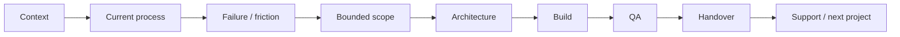

# Delivery Model

VAREVANT is designed to sit between a known business requirement and the technical work needed to make it operational.

The engagement model is intentionally narrow: diagnose only what is necessary, define a bounded implementation, validate it, and hand over a system that another competent operator can understand.

## 1. Direct implementation

Use this model when VAREVANT works directly with the business that owns the process.

### Inputs

- current workflow and system map;
- known bottleneck or failure point;
- required integrations and access;
- decision owner;
- success criteria;
- constraints around security, timing, and existing tools.

### Outputs

Depending on the scope, delivery may include:

- workflow orchestration;
- API/CRM/database integration;
- internal tools or dashboards;
- bounded AI-agent components;
- implementation notes;
- QA evidence;
- handover documentation.

## 2. White-label technical execution

Use this model when an agency, advisor, or consultant owns the end-client relationship and needs technical delivery capacity behind the scenes.

### Partnership boundary

The partner can remain client-facing while VAREVANT owns an agreed technical scope.

Before work begins, both sides should explicitly agree:

- who owns the client relationship;
- whether VAREVANT is visible to the end client;
- who gathers requirements;
- who approves scope changes;
- who has access to production systems;
- what constitutes acceptance;
- how support and handover work after launch.

### Typical fit

White-label execution is most useful when:

- the client problem is already understood;
- the agency does not want to hire permanent engineering capacity for the project;
- the work needs custom automation, backend, API, CRM, data, or AI implementation;
- the engagement has a clear owner and a bounded delivery outcome.

### Poor fit

VAREVANT should not be used as an invisible catch-all for an undefined project.

The model is a poor fit when:

- there is no confirmed business problem;
- the scope is still mostly sales speculation;
- access or ownership is unclear;
- the partner expects uncontrolled revisions;
- the project requires claims, results, or guarantees that cannot be evidenced.

## Delivery stages

### Stage 1 — Context

Understand the operating environment and why the work matters commercially.

### Stage 2 — Current process

Map only what is needed to understand the workflow. Avoid redesigning the whole company when one handoff is the actual problem.

### Stage 3 — Failure / friction

Identify the observable breakdown: delay, duplicate work, missing state, routing failure, fragmented data, manual handoff, or unclear ownership.

### Stage 4 — Bounded scope

Define the smallest implementation that can prove whether the proposed mechanism works.

### Stage 5 — Architecture

Define events, systems of record, permissions, branching logic, approvals, error paths, and logging before wiring tools together.

### Stage 6 — Build

Implement the agreed technical layer without silently expanding the project.

### Stage 7 — QA

Test expected paths, failure paths, duplicate events, permissions, retries, and production boundaries.

### Stage 8 — Handover

Document ownership, deployment state, known constraints, credentials boundary, and next-step support.

## Change control

A professional implementation should separate:

- **bug:** agreed behavior does not work as specified;
- **scope clarification:** requirement was ambiguous but still inside the agreed outcome;
- **scope change:** new behavior, new integration, or new operating requirement;
- **next project:** valuable work that should not destabilize the current delivery.

This protects both sides from turning a bounded implementation into indefinite unpaid consulting.

## Commercial principle

VAREVANT does not sell tools as the main value proposition.

The order is:

**context → evidence → current process → friction → consequence → desired outcome → smallest credible intervention**.

n8n, Supabase, APIs, CRMs, LLMs, or custom code are selected only after that sequence is clear.