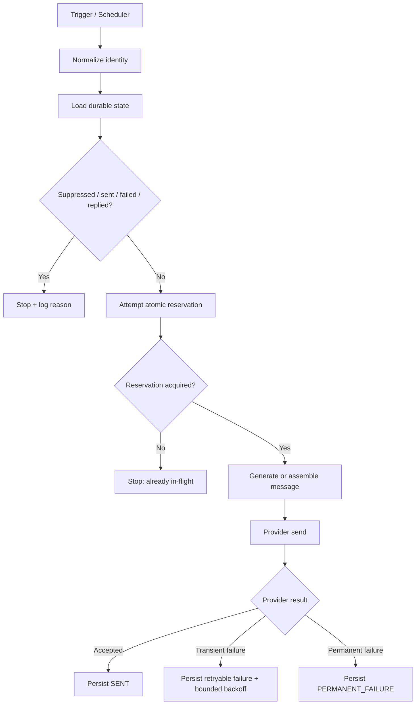

# n8n Outbound Automation Production Gate

A public, vendor-specific implementation reference for teams using n8n to automate outbound or other externally visible actions.

This is an engineering standard and test specification. It is **not** a client case study, performance claim, or guarantee that every workflow implements every control below.

## Why this exists

An automation can look correct in a manual test and still fail under scheduler overlap, retries, concurrent executions, stale state, or provider errors. For outbound systems, those failures can create duplicate messages, repeated contact after a hard failure, or uncontrolled retries.

The safest design principle is simple:

> No irreversible external action should run until deterministic eligibility, idempotency, suppression, and concurrency checks have passed.

## Required invariants

Before a Gmail, SMTP, CRM-send, messaging, payment, mutation, or other side-effect node executes, the workflow should enforce the relevant invariants below.

### 1. Canonical identity

Normalize the target before lookup.

For an email recipient, a common canonical key is:

```text
lowercase(trim(email))
```

If business rules operate at account or domain level, store those keys separately rather than overloading the recipient key.

### 2. Persistent state

Eligibility must be based on durable state, not only data inside the current execution.

Useful states include:

```text
NEW
RESERVED
SENT
PERMANENT_FAILURE
SUPPRESSED
REPLIED
```

The exact state model can differ, but a new execution must be able to see what a previous or concurrent execution already did.

### 3. Atomic reservation before side effect

A workflow should reserve the canonical target **before** the send node.

Conceptually:

```text
NEW -> RESERVED -> SENT
```

Only one execution should be able to win the `NEW -> RESERVED` transition for the same idempotency key.

A read-then-write sequence without an atomic constraint is vulnerable to a race:

```text
Execution A reads NEW
Execution B reads NEW
Execution A sends
Execution B sends
```

Prefer a database uniqueness constraint, transactional update, compare-and-set operation, lock/lease, or equivalent mechanism provided by the system of record.

### 4. Deterministic suppression gate

Targets in any stop state must be rejected before generative or copy-writing logic runs.

Typical stop states:

```text
SENT
PERMANENT_FAILURE
SUPPRESSED
UNSUBSCRIBED
REPLIED
ACTIVE_CONVERSATION
```

An LLM should never decide whether an unsubscribe, prior send, bounce, or duplicate is allowed to pass.

### 5. Retry classification

Do not retry every failure.

Classify failures into at least:

- transient / retryable;
- permanent / non-retryable;
- unknown / review-required.

For retryable failures, define a maximum attempt count and backoff policy. For permanent failures, persist the stop state so a scheduler cannot select the target again.

### 6. Concurrency boundary

Scheduler frequency is not the same as execution safety.

If a workflow can overlap with itself, or several workers can process the same pool, the idempotency guarantee must still hold. Throughput should be increased only after concurrent-run tests pass.

### 7. Side-effect-first observability

For each externally visible action, log enough information to reconstruct what happened without exposing secrets.

Minimum useful fields:

```text
execution_id
idempotency_key
state_before
reservation_result
attempt_number
action_type
provider_result
state_after
timestamp
```

Never log credentials, OAuth tokens, API keys, or private message bodies into a public artifact.

## Reference control flow



## Minimum pre-production test matrix

A workflow is not production-ready until the important failure modes have been exercised.

| Test | Expected result |
| --- | --- |
| Same target submitted twice sequentially | One external action maximum |
| Same target submitted concurrently | One reservation winner, one blocked execution |
| Scheduler overlaps previous execution | No duplicate external action |
| Provider returns transient error | Bounded retry only |
| Provider returns permanent rejection | Persist stop state; no future send |
| Target is already suppressed | Stop before message generation/send |
| Workflow execution is manually retried | No duplicate side effect if original action already succeeded |
| State store is unavailable | Fail closed for high-risk external action |
| Logging path fails | External action policy is explicit; do not silently lose auditability |

## n8n implementation mapping

The exact nodes depend on the stack, but the control responsibilities are stable:

1. **Trigger** — Schedule Trigger, Webhook, form, queue, or another event source.
2. **Normalize** — Edit Fields or Code node for canonical keys.
3. **State lookup / reservation** — database, CRM, Data Table, or API-backed system of record with an atomic uniqueness/locking strategy.
4. **Deterministic gate** — IF/Switch/Code logic based on persisted state.
5. **Message generation** — only after the hard gate passes.
6. **External action** — Gmail, SMTP, CRM, messaging, payment, or mutation node.
7. **Result persistence** — update durable state immediately after provider outcome.
8. **Error workflow / alerting** — route material failures to an explicit owner or incident path.

Do not treat a Remove Duplicates node inside one execution as a substitute for persistent cross-execution idempotency.

## Release gate

Before increasing production volume, verify all of the following:

- canonical idempotency key is defined;
- durable system of record is explicit;
- reservation occurs before the irreversible action;
- concurrent executions cannot reserve the same target;
- suppression and permanent-failure states fail closed;
- manual retries are replay-safe;
- retry count and backoff are bounded;
- provider outcomes are persisted;
- rollback / disable path is documented;
- logs are sufficient to audit one target across executions;
- no secrets or private prospect/client data are exposed in public logs or repositories.

## Related n8n documentation

- Executions and retry behavior: https://docs.n8n.io/workflows/executions/all-executions/
- Scaling and concurrency documentation: https://docs.n8n.io/hosting/scaling/overview/
- Security audit: https://docs.n8n.io/hosting/securing/security-audit/

## Reuse

Teams may adapt this checklist to their own n8n architecture. When the irreversible action is not email, replace `recipient` with the relevant business identity and apply the same reservation-before-side-effect principle.
