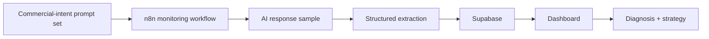

# Selected Work — Evidence-Led Notes

This file documents what VAREVANT can publicly show today and, equally important, what it does **not** claim.

The goal is to make technical proof easy to review without turning internal builds into inflated case studies.

## 01 — VAREVANT Revenue Operations System

**Type:** Internal operating system / engineering proof  
**Status:** Self-built and operated by VAREVANT  
**Public evidence:** Command-center interface and workflow architecture visual

### What the system is designed to do

The system sits between an incoming opportunity and the next commercial action. Its role is to keep lead state, routing, follow-up, and operational visibility from depending on manual memory.

Publicly demonstrated layers include:

- intake and event capture;
- qualification/routing logic;
- follow-up orchestration;
- pipeline/database state updates;
- operational visibility through a command-center interface;
- workflow separation between deterministic control and language-model assistance.

### Public artifacts

- [`../assets/varevant-command-center.png`](../assets/varevant-command-center.png)
- [`../assets/varevant-workflow.png`](../assets/varevant-workflow.png)

### Evidence boundary

This is an internal VAREVANT system. It should not be presented as a third-party client case study, and no third-party revenue result, client logo, or testimonial should be inferred from it.

---

## 02 — WellnessHub Command Center

**Type:** Self-built product / client-management system  
**Status:** Internal product work  
**Public evidence:** Command-center interface

### What it demonstrates

The interface demonstrates consolidation of several operating views that would otherwise live in separate tools or exports:

- sales tracking;
- order status;
- client history;
- product performance;
- one operating view instead of fragmented lookups.

### Public artifact

- [`../assets/wellnesshub-command-center.png`](../assets/wellnesshub-command-center.png)

### Evidence boundary

WellnessHub is shown as product and systems work built by VAREVANT. It is not presented as a paid third-party implementation unless separate evidence supports that claim.

---

## 03 — BIMMCA Intelligence

**Type:** AI Authority Intelligence dashboard  
**Repository:** [naraya07pedro-spec/bimmca-intelligence](https://github.com/naraya07pedro-spec/bimmca-intelligence)

### What the public repository shows

The dashboard layer currently exposes:

- AI authority metrics;
- competitive comparison views;
- strategic-gap analysis;
- strategy-center outputs;
- evidence/source views;
- live data consumption from Supabase;
- a monitoring cadence described in the interface as an n8n run every 30 minutes.

The dashboard code also makes an explicit methodological distinction between sampled AI responses and the much broader population of all AI conversations. That boundary matters: a monitoring sample is evidence, not omniscience.

### Public-safe architecture

### Evidence boundary

The public repository shows the dashboard and public-safe application logic. It does not publish private automation credentials, service-role database access, confidential source material, or any client-private data.

---

## Why some production code is not public

A serious implementation repository should not expose confidential client data or credentials simply to look impressive.

For private systems, VAREVANT uses a narrower proof surface:

1. sanitized architecture;
2. non-sensitive screenshots or recordings;
3. bounded code samples where useful;
4. delivery and QA methodology;
5. direct walkthrough when disclosure is appropriate.

The standard is simple: **show enough to prove how the work is approached, but never manufacture proof or leak what should remain private.**