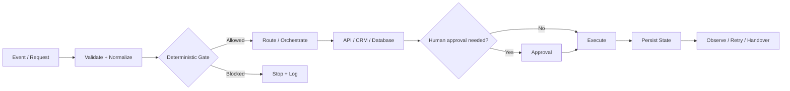

# Technical Review Guide

This guide is for engineers, hiring teams, agency partners, or technical reviewers who want to understand what the public VAREVANT repositories actually demonstrate without relying on marketing claims.

## Five-minute review path

1. Read [`SELECTED-WORK.md`](SELECTED-WORK.md) for the evidence-backed project map.
2. Run the tested [`Reliable Lead Routing`](../examples/reliable-lead-routing/) reference implementation to inspect deterministic gates, idempotency, bounded AI routing, and retry behavior in code.
3. Read [`PRODUCTION-SAFETY.md`](PRODUCTION-SAFETY.md) for the control boundaries used around automation and AI-assisted workflows.
4. Inspect [`../assets/varevant-workflow.png`](../assets/varevant-workflow.png) for the public workflow architecture visual.
5. Review the separate [BIMMCA Intelligence repository](https://github.com/naraya07pedro-spec/bimmca-intelligence) for a Supabase-backed dashboard/application surface fed by an n8n monitoring architecture.
6. Use [`DELIVERY-MODEL.md`](DELIVERY-MODEL.md) to understand how implementation scope, handoff, and white-label boundaries are handled.

## What the public work demonstrates

### Workflow and orchestration design

The public material shows an engineering approach built around controlled state transitions rather than disconnected automations:

The important distinction is intentional: deterministic rules handle hard gates, permissions, suppression, deduplication, and irreversible actions; LLMs are used where language interpretation or bounded judgment is useful.

### Integration-oriented engineering

The public repositories and documentation cover patterns involving:

- APIs and webhooks;
- CRM and operational workflow integration;
- database-backed state;
- Supabase/PostgreSQL-backed application surfaces;
- routing and follow-up orchestration;
- retries, deduplication, logging, and human approval boundaries;
- documentation and handover for maintainability.

### Public-safe proof

Some production logic should not be public. The review surface therefore separates:

- what can be inspected directly in code or documentation;
- what can be shown safely as architecture or screenshots;
- what remains private because it contains credentials, client data, or sensitive operating logic.

This is a deliberate security and evidence decision, not an attempt to imply hidden results that cannot be verified.

## Selected public evidence

### Reliable Lead Routing reference implementation

**What it demonstrates:** directly inspectable and testable code for validation, suppression, geography gates, idempotency, bounded classification, manual-review fallback, and bounded retry behavior.

Files:

- [`../examples/reliable-lead-routing/README.md`](../examples/reliable-lead-routing/README.md)
- [`../examples/reliable-lead-routing/workflow.js`](../examples/reliable-lead-routing/workflow.js)
- [`../examples/reliable-lead-routing/workflow.test.js`](../examples/reliable-lead-routing/workflow.test.js)

This is a sanitized reference implementation, not client code or a production export.

### VAREVANT Revenue Operations System

**What it demonstrates:** lead flow, routing, follow-up, pipeline state, operational visibility, and separation between deterministic controls and language-model assistance.

Public artifacts:

- [`../assets/varevant-command-center.png`](../assets/varevant-command-center.png)
- [`../assets/varevant-workflow.png`](../assets/varevant-workflow.png)

This is internal engineering proof, not a third-party client case study.

### BIMMCA Intelligence

**What it demonstrates:** a public dashboard/application layer that consumes Supabase-backed state produced by a monitoring architecture involving n8n and structured AI-response extraction.

Repository:

- [naraya07pedro-spec/bimmca-intelligence](https://github.com/naraya07pedro-spec/bimmca-intelligence)

The repository explicitly separates sampled AI-response evidence from claims of universal platform visibility.

### WellnessHub Command Center

**What it demonstrates:** consolidation of sales, order, client-history, and product-performance views into one operating interface.

Public artifact:

- [`../assets/wellnesshub-command-center.png`](../assets/wellnesshub-command-center.png)

This is self-built product/systems work and is not represented as a paid third-party implementation without separate evidence.

## What this portfolio does not claim

The public repositories do not claim:

- fabricated client outcomes or revenue lifts;
- access to private model conversations;
- production credentials or private client data;
- that every private workflow is publishable;
- that a language model is allowed to bypass deterministic business controls.

## Relevant technical surface

The public work is most relevant to roles or projects involving:

- workflow automation;
- API and webhook integration;
- backend orchestration;
- Supabase/PostgreSQL-backed workflows;
- CRM and revenue-operations systems;
- bounded AI-agent or LLM-assisted workflows;
- technical implementation and systems integration.

## Contact

**Evan Naraya — VAREVANT**  
[evan@varevant.com](mailto:evan@varevant.com) · [varevant.com](https://varevant.com) · [LinkedIn](https://www.linkedin.com/in/evannaraya)
