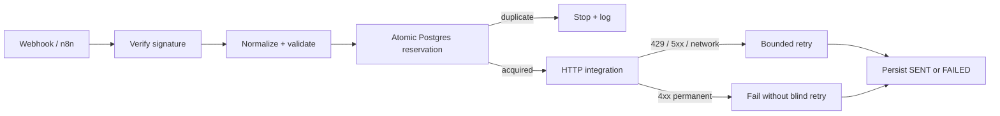

# Production Integration Reference

A public-safe TypeScript reference showing the engineering controls behind a small but realistic system-to-system integration.

This is **not client code and not a production export**. It exists so a technical reviewer can inspect more than architecture prose: webhook verification, durable idempotency, retry classification, a real HTTP integration boundary, PostgreSQL state, tests, and a sanitized n8n workflow export are all represented in code.

## What it demonstrates

- HMAC webhook verification with timing-safe comparison;
- deterministic normalization and validation;
- atomic PostgreSQL reservation using a unique idempotency key;
- reservation **before** an irreversible downstream side effect;
- replay / duplicate blocking across process restarts;
- actual HTTP integration code using bearer authentication;
- explicit retry classification for 408, 429, 5xx, and network errors;
- exponential backoff with bounded attempts and jitter;
- structured logging without credentials or message-body leakage;
- persisted SENT / FAILED state;
- unit tests for replay safety, transient retry, permanent failure, and webhook verification;
- an importable, sanitized n8n orchestration example.

## Architecture



The key production choice is the reservation boundary. A memory-only Set can demonstrate idempotency inside one process, but it cannot protect against restarts or concurrent workers. This reference moves the idempotency state into PostgreSQL and relies on a unique constraint plus INSERT ... ON CONFLICT DO NOTHING so only one execution wins the reservation.

## Review path

1. ```src/handler.ts``` — orchestration and side-effect ordering.
2. ```src/idempotency.ts``` — durable atomic reservation.
3. ```src/retry.ts``` — retryability classification and bounded backoff.
4. ```src/http-client.ts``` — real REST boundary.
5. ```src/webhook.ts``` — HMAC verification.
6. ```tests/``` — replay, retry, and signature behavior.
7. ```n8n/workflow.sanitized.json``` — public-safe orchestration export.

## Run locally

Requirements:

- Node.js 20+
- PostgreSQL

Install and test:

```bash
npm install
npm run typecheck
npm test
```

Create the table:

```bash
psql "$DATABASE_URL" -f db/001_init.sql
```

Start the reference service:

```bash
export DATABASE_URL="postgresql://..."
export WEBHOOK_SECRET="replace-me"
export DOWNSTREAM_URL="https://example.test/api/leads"
export DOWNSTREAM_TOKEN="replace-me"
npm start
```

A POST to ```/events/lead``` must include ```x-webhook-signature```, the SHA-256 HMAC of the exact raw request body using ```WEBHOOK_SECRET```.

## Failure model

| Failure | Behavior |
| --- | --- |
| invalid payload | block before reservation |
| duplicate / replay | no second downstream call |
| 408 / 429 / 5xx | bounded retry |
| 4xx permanent error | no blind retry |
| repeated failure | persist FAILED |
| invalid HMAC | reject before parsing / side effects |
| process restart | reservation survives in PostgreSQL |

## What this intentionally does not claim

- It does not claim client production usage.
- It does not publish production credentials.
- It does not claim exactly-once delivery across every possible external provider.
- It does not pretend an n8n Remove Duplicates node is equivalent to cross-worker durable idempotency.

The purpose is narrower: make the production-safety patterns described elsewhere in this repository directly inspectable in implementation code.
