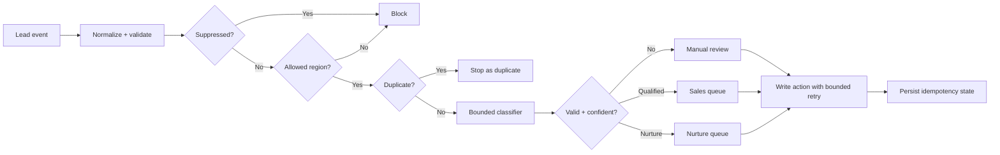

# Reliable Lead Routing — Reference Implementation

This is a **sanitized reference implementation**, not client code and not a production export.

It demonstrates how VAREVANT separates deterministic controls from AI-assisted interpretation in a lead-routing workflow.

## What this example demonstrates

- input normalization and validation;
- suppression before any AI call or side effect;
- region hard gates;
- deterministic idempotency / duplicate prevention;
- injected classifier interface rather than hard-wiring one AI vendor;
- confidence thresholds that fall back to manual review;
- bounded retries around downstream side effects;
- an auditable action payload containing route and reason.

## Flow



The key design choice is that hard gates happen **before** the classifier. The classifier can influence a bounded routing decision; it cannot override suppression, geography, validation, or duplicate controls.

## Run the tests

Requires a modern Node.js runtime with the built-in test runner.

```bash
node --test examples/reliable-lead-routing/workflow.test.js
```

The tests cover:

- normalization;
- suppression;
- region blocking;
- qualified routing;
- low-confidence manual review;
- idempotency;
- bounded retry behavior.

## Files

```text
examples/reliable-lead-routing/
├── README.md
├── workflow.js
└── workflow.test.js
```

## Production notes

A real deployment would replace the injected `classifier` and `writeAction` functions with specific adapters for the chosen model, CRM, database, queue, or API.

Production deployment would also normally persist idempotency state outside process memory and add structured observability, authentication, access controls, and service-specific retry policies.

Those details are intentionally not faked here. The purpose of this example is to make the control pattern directly inspectable and testable.
