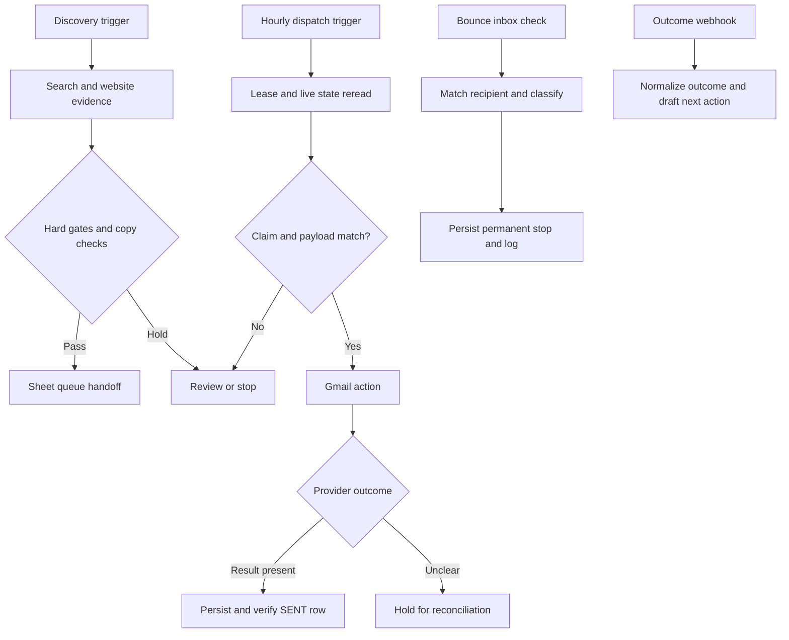

# Historical workflow architecture

This diagram is derived from [the sanitized V6 export](workflows/revenue-workflow-v6.sanitized.json). It is an architecture diagram, not a reconstructed execution screenshot.

## State ownership before the side effect

`Freeze Current Candidate` stores an execution-specific context. `Confirm Still Sendable` reloads sheet rows and rejects changed recipients, existing provider IDs, suppression markers, out-of-window timing and duplicate keys. `Claim Row` writes a claim; `Re-read Claimed Row` reloads it; `Verify Claim` checks the execution/row token, pending state, sender lane, provider IDs and frozen-copy fingerprint.

The claim and reread are inspectable defenses against stale inputs. They are not a database transaction. Two executions may still race between reads and writes. The static-data lease does not close that gap; see [failure modes](FAILURE-MODES.md).

## Result persistence and recovery

`Verify SENT Commit (LANE-A)` compares the reread row with an execution-specific success record. A matching Gmail result supports provider acceptance; it does not establish recipient delivery. Incomplete success objects and ambiguous send errors route to `SEND-UNKNOWN - RECONCILE`. Permanent-recipient errors use a stop state. Sender configuration/quota errors halt the lane for that run.

Source labels, schedule settings and caps describe intended behavior. They do not prove that the scheduler was active, that a given volume ran, or that every branch succeeded.

## Where AI belongs

The optional local-model draft is followed by a deterministic copy gate and a deterministic fallback. The gate checks lexical constraints and the presence of company/evidence fields. A nonempty evidence URL is not proof that a generated claim follows from it.

Eligibility, suppression and claim ownership remain Code/IF/Switch decisions. The reply classifier produces drafts and next-action labels; it does not implement an authenticated approval step. A deployment needs a separate enforced approval boundary for decisions that require a human.

## Why the backend reference is separate

The [PostgreSQL reservation implementation](https://github.com/naraya07pedro-spec/production-integration-reference/blob/main/src/idempotency.ts) demonstrates unique-key reservation before a side effect. Its tests exercise real database contention in CI. That is a stronger concurrency boundary than the Sheets/static-data mechanism shown here; it is a reference design, not a claim that this historical n8n export used PostgreSQL.
