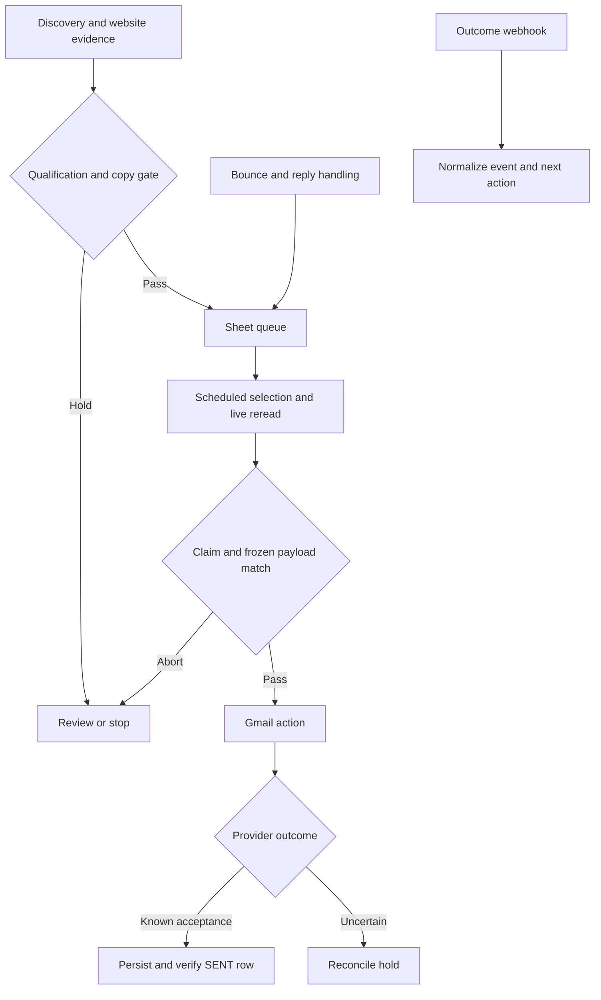

# Reliable Multi Workflow Automation and Integration System

Evan Naraya's VAREVANT workflow engineering: state checks before external actions, inspectable failure handling, and reproducible recovery tests. The strongest result is an archived per-item error-handler repair reproduced in real n8n with saved final Error and Success records. Related source regressions verify Cloud-compatible policy loading, clean no-send outputs and worker identity after queue reads.

## Context and operational problem

Revenue operations crosses discovery, evidence review, queue ownership, email actions, follow-up and commercial status. An execution can finish successfully without sending anything; a provider can accept an action before persistence fails. Both need explicit state rather than a green canvas as the only success signal.

The selected V6 export has 117 nodes, 60 JavaScript Code nodes and 153 graph connections. These are inspectable structure counts. Multiple entrypoints and branch responsibilities exist inside one historical export; this does not establish five independently deployed VPS services. Later V9, V10.1 and V19 sources are separate revisions and are not combined into a claimed historical runtime.

## System architecture and workflow boundaries

The discovery branch gathers evidence and queues candidates. The dispatcher selects eligible rows, freezes context, rereads state, claims an exact row, waits and routes a validated payload. Bounce/reply and outcome branches alter future eligibility. [Architecture](ARCHITECTURE.md) describes the actual V6 edges. The worker-identity repair belongs to a later archived selector, not this V6 graph.

## API and webhook integration

V6 connects HTTP search/model requests, Gmail and Google Sheets. Outcome webhook events are normalized into a supported vocabulary, but that export does not configure webhook authentication or durable event deduplication. Credentials and private endpoints are removed from the public review copy; external nodes are disabled and the workflow is inactive.

The separate [TypeScript and PostgreSQL reference](https://github.com/naraya07pedro-spec/production-integration-reference) demonstrates raw-byte HMAC verification before parsing, validation before reservation and an immutable source/event identity. It is runnable synthetic backend proof, not the database behind V6 or a private client's system.

## State model

| State or signal | Meaning and boundary |
| --- | --- |
| QUEUED - SENDABLE - UNSENT | Candidate still requires live eligibility and ownership checks |
| CLAIMED - PENDING SEND | Execution/row token records intended ownership; Sheets does not make it atomic |
| Verify Claim abort | Token, status, existing provider ID or frozen-copy mismatch prevents this attempt |
| SENT and COMPLETED | Must match the stored row, lane, account and Gmail result; acceptance is not inbox delivery |
| SEND-UNKNOWN - RECONCILE | Provider outcome unclear; investigate before another action |
| BOUNCED - PERMANENT | Stop state with suppression marker for matching recipient evidence |
| NO_SEND | Expected diagnostic outcome; not equivalent to a successful email send |

## Idempotency and deduplication

The historical export checks existing provider IDs, recipients and related business identities, frozen payloads and suppression state. Those are layered eligibility defenses. A noncryptographic 32-bit fingerprint detects copy changes; it is not an authorization signature. Domain grouping uses a curated suffix list and can miss cases.

Durable idempotency is demonstrated separately in the backend reference: a PostgreSQL unique key and atomic INSERT choose a winner before HTTP send, and persisted SENT, FAILED or RESERVED state blocks replay while retained. Updating an email does not create a new identity. Safe repeated provider requests still depend on that provider honoring the stable Idempotency-Key.

## Concurrency and race conditions

V6 static-data lease logic excludes another owner only within the shared state it sees. An existing regression shows independent snapshots can both grant the lease. Claim/read/verify narrows stale-state risk but leaves a race between the final read and write. This pack does not claim a distributed n8n lock.

V10.1 fixtures prove lane identity and disjoint selection under their input model. They do not prove atomic claims. The PostgreSQL reference's real database contention test in CI separately exercises 12 contenders for one reservation.

## Retries and failure classification

Gmail automatic retry is disabled in V6. Search and some Sheet nodes have bounded node-level retries. A repeated append can duplicate a record if its first response is lost. Retry policy must distinguish reads from side effects and know whether an external action could already have happened.

V6 classifies permanent recipient errors, sender configuration/quota failures and ambiguous outcomes. Sender failures halt that lane for the run; the error-text classification is heuristic. The backend reference retries 408, 429, 5xx and transport failures within bounded exponential delay and jitter, while other errors stop. It does not implement Retry-After coordination or distributed rate limiting.

## Validation and AI boundary

Code/IF/Switch gates own eligibility, suppression and claim checks. Optional model output passes lexical shape/length/context rules and a deterministic fallback; malformed output can route to HUMAN_COPY_REVIEW. This is not a semantic fact checker. Reply labels support human review but do not enforce an authenticated approval transition. Actual LLM tool/function calling is not established by the selected export.

## Partial failure and observability

A Gmail send, Sheet commit and log append are separate operations. Verify SENT Commit compares the reread row with the stored provider result. Dedicated error paths and reconcile holds make incomplete commits visible; they do not create a cross-provider transaction.

Historical node/log content may include private fields. The backend reference uses fixed event categories and excludes payloads, tokens and provider messages from logs. Production correlation, retention, alert ownership and a measured service-level objective require deployment evidence; no such metrics are invented here.

## Recovery strategy

Stop further selection for an uncertain action, inspect the provider outcome and frozen payload, reconcile the claim and provider IDs, and retry only after nonacceptance is established or tested provider idempotency protects it. Preserve evidence of the reconciliation and verify the state write. This is the documented procedure; a historical execution of that whole procedure is not recovered.

The real n8n handler reproduction is narrower: five synthetic nodes, identical input, one changed Code body and a fresh local SQLite data directory. It never sends email or contacts a search/model provider.

## Incident case one Per item fallback contract

The historical V19 fallback failed while handling search failure. Archived before code returned an array in per-item mode; V19.1 returns one json object, clears stale search content and preserves context. The reproduced saved execution changes from error to success. The exact historical message differs from the reproduced engine validator. [Full case](incidents/incident-01-handler-contract.md).

## Incident case two Cloud configuration contract

V2's policy node visibly failed on denied environment access. Archived V3 removes all 15 environment reads from the full export. The new fixture deliberately blocks environment access: V2 fails and V3 completes. Historical whole-workflow recovery remains unverified. [Full case](incidents/incident-02-cloud-environment.md).

## Incident case three Worker identity across queue reads

The V10.1 repair note and historical user report describe lost worker identity and success without work. The selector now reads the executed lane-specific Acquire node, retaining static lease fallback. Entire-selector fixtures select 25 disjoint rows per lane; missing identity selects zero. No live throughput is asserted. [Full case](incidents/incident-03-worker-identity.md).

## Additional cases and lessons

The [no-send diagnostic repair](incidents/incident-04-no-send-contract.md) shows that expected stop paths also need valid contracts. The [daily-state repair](incidents/incident-05-daily-state.md) preserves action ownership across repeated observations. These are the other two ranked flagship cases.

Useful engineering checks follow from the cases: inspect the first broken node rather than rewrite the graph; preserve identity across nodes that replace input; test stop/error branches; distinguish selected, called, accepted and committed actions; and never promote an in-memory guard to a distributed guarantee.

## Testing and deployment boundary

Run `node --test n8n/tests/*.test.mjs`, `node n8n/scripts/extract-nodes.mjs --check` and the [recorded engine verifier](runtime-evidence/reproduced-recovery/verify-recorded.mjs). CI also reruns the isolated real-n8n recovery. New source regressions are in [incident-source.test.mjs](tests/incident-source.test.mjs). These tests use synthetic inputs and preserve archived source logic with recorded privacy substitutions.

The public historical workflow is an inactive review artifact. Engine recovery runs locally and in CI. Backend PostgreSQL/signed-HTTP tests run against disposable test infrastructure. Actual scheduler publication, VPS uptime, current production configuration and a private client acceptance environment are not established.

## Evidence index and limitations

| Inspect | Evidence |
| --- | --- |
| Historical source | [Sanitized V6 JSON](workflows/revenue-workflow-v6.sanitized.json), [source notes](SOURCE-NOTES.md) |
| State controls | [Extracted source](extracted/), [control tests](tests/exported-controls.test.mjs) |
| Exact archived repair excerpts | [Hashes and provenance](incidents/sources/manifest.json), [new regression](tests/incident-source.test.mjs) |
| Saved reproduced recovery | [Before/after records and report](runtime-evidence/reproduced-recovery/recorded/) |
| Historical captures | [Source to execution mapping](runtime-evidence/SOURCE-TO-EXECUTION.md), [remaining gaps](runtime-evidence/SEARCH-AND-GAPS.md) |
| Backend and database | [Reliability review](https://github.com/naraya07pedro-spec/production-integration-reference/blob/main/docs/RELIABILITY-REVIEW.md) |
| Supporting consumer | [BIMMCA debugging case](https://github.com/naraya07pedro-spec/bimmca-intelligence/blob/main/docs/DEBUGGING-CASE.md) |
| Private engagement scope | [Client work](https://github.com/naraya07pedro-spec/naraya07pedro-spec/blob/main/CLIENT-WORK.md) |

Exact historical V6 and V19 saved executions, source-revision identity and historical final recovery status remain missing. Client scope statements are Level E; MAXY is reported implementation scoping, with no proved completed build. No production volume, uptime, ROI, client acceptance, exactly-once delivery or autonomous permission enforcement is implied.
