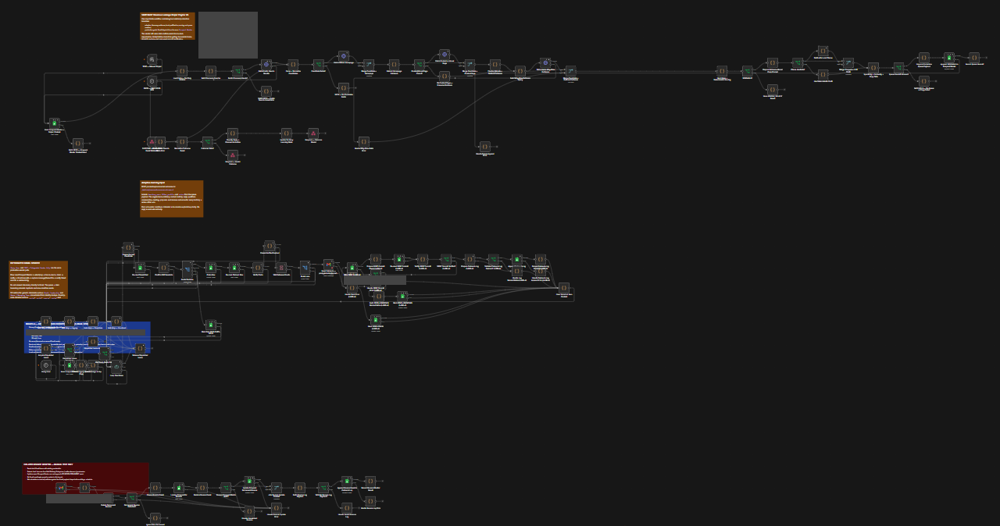

# Runtime evidence

**Strong historical V6 workflow/path association and a reproduced V19 → V19.1 handler recovery in real n8n.** The screenshots are historical; the clearly labeled synthetic recovery records were captured on October 2, 2026.

Full-canvas **EDITOR TOPOLOGY**, V7. Top: discovery and evidence processing; middle: outcome and dispatch branches; bottom: bounce monitoring. This overview shows branch arrangement. The original labels are small; use the source and close crops for readable controls. V7 is a different revision from the selected V6 export. Annotation wording and numeric limits are historical configuration, not verified operating results.

| Open next | What it establishes | Limit |
| --- | --- | --- |
| [Source → execution](SOURCE-TO-EXECUTION.md) | Selected uploaded V6 export and screenshot share a privately checked workflow identity; visible dispatcher false branch agrees with source connections and positions. | **STRONG MATCH** for workflow identity and path, not exact runtime Code-node snapshot. |
| [Handler recovery](RECOVERY-CASE.md) | Historical handler failure/patch/passing-path observations, plus real n8n reproduction using identical synthetic input and saved final error/success records. | **REPRODUCED**, not historical production recovery. Exact historical imported file and complete historical success remain unverified. |
| [Reproduce and inspect saved records](reproduced-recovery/README.md) | Pinned n8n runtime, one-field patch, executed workflow snapshots, hashes and CI rerun. | Five-node local test; historical provider/aggregator/email branches are excluded. |
| [Search, privacy and remaining material](SEARCH-AND-GAPS.md) | Sources reviewed, rejected associations, client evidence level and precise missing records. | Search findings are scoped to accessible artifacts. |
| [Visual provenance](visual-manifest.json) | Original/published SHA-256, archive dates, crops and redaction coordinates. | Original private URLs and identities are withheld. |

The close crops show the same original screenshots, not additional executions. Green nodes establish visible node state; they do not establish inbox delivery, provider reliability, deployment, throughput, or ROI. No generated or reconstructed runtime imagery is included.

For the broader implementation, return to [n8n source and tests](../README.md). The [older five-image gallery](https://github.com/naraya07pedro-spec/production-integration-reference/tree/main/docs/evidence) remains at its canonical location.
