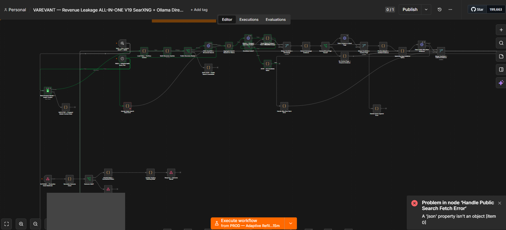
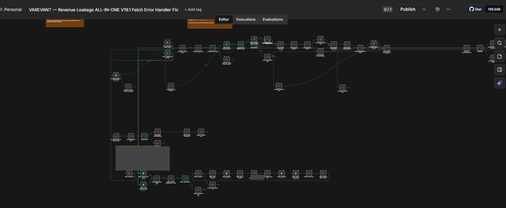
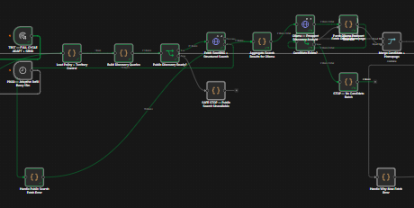

# Error-handler return-shape recovery

**Status: REPRODUCED RECOVERY TEST / NOT HISTORICAL PRODUCTION EXECUTION.** The archived V19 handler fails and the historical V19.1 correction passes the same synthetic input in isolated n8n, with saved final `error` → `success` records. Historical screenshot/source association remains **STRONG**; exact historical imported source and complete historical Success remain unverified.

## Context

The V19 discovery branch sends public-search failures to `Handle Public Search Fetch Error`, then to `Aggregate Search Results for Ollama`. The handler should preserve item context, clear unusable search HTML and mark the failure so downstream logic can proceed safely.

This case uses actual uploaded screenshots and **archived model-generated source artifacts**. The source files show a correction; generated packaging does not prove human code authorship, import, deployment or the exact runtime code.

## Failure



The original screenshot `0ce75fa0-cf4a-4a18-814c-967ba2a3d85a.png` was archived **2026-08-07 11:48:32 UTC**. Its desktop clock reads **6:48 PM, August 7**; timezone and execution start are not shown.

The named handler is red. The toast reads: **A 'json' property isn't an object [item 0]**. The public-search node and incoming error route are visible. Other green nodes do not cancel this observed failure.

## Observed evidence

| Artifact | Archive date/time (UTC) | Observation |
| --- | --- | --- |
| Generated V19 SearXNG/Ollama source | Aug 7, 09:27:11 | Handler mode is `runOnceForEachItem`; returns an array containing a JSON item. |
| Uploaded V19 error screenshot | Aug 7, 11:48:32 | The handler and payload-shape error are visible. |
| Generated V19.1 Fetch Error Handler Fix source | Aug 7, 11:50:47 | Same 73-node graph, same node positions and connections; only this node's parameters change, plus the workflow title. |
| Generated V19.1A source | Aug 7, 12:21:01 | Same corrected handler body; other changes mean the exact later variant is ambiguous. |
| Uploaded V19.1 screenshot | Aug 7, 12:31:52 | Same error-route handler is green and connects to the green aggregator; downstream no-candidate stop is green. |

Full original source filenames and SHA-256 fingerprints are in [recovery-source-manifest.json](recovery-source-manifest.json). Public [before](source/v19-fetch-error-handler.json) and [after](source/v19-1-fetch-error-handler.json) excerpts preserve the exact node body, mode, position and outgoing edge; IDs are omitted. The full generated workflows are not duplicated here.

## Root cause

The archived V19 handler has a return-shape mismatch: **an array is returned in per-item mode**. The V19.1 correction returns one item object instead. This is a source-backed explanation consistent with the observed error, not a recovered stack trace or proof that the screenshot's hidden code was byte-identical.

The [official Code-node documentation](https://docs.n8n.io/integrations/builtin/core-nodes/n8n-nodes-base.code/) distinguishes per-item and all-items modes. The [official common-issues page](https://docs.n8n.io/integrations/builtin/core-nodes/n8n-nodes-base.code/common-issues/) explains the JSON-object output requirement. Historical n8n version and validation implementation are not recorded.

## Patch

Exact archived handler bodies:

```diff
-return [{json:{...$json,search_html:'',public_search_error:true}}];
+return {json:{...$json,search_html:'',public_search_error:true}};
```

The mode remains `runOnceForEachItem`. Node name, type, position and outgoing aggregator connection remain unchanged. Across the two base source artifacts, this is the only changed node; all graph connections compare equal. The historical correction predates this portfolio publication; the GitHub PR packages evidence rather than repairing a live workflow.

## Validation

[Offline contract tests](../tests/recovery-contract.test.mjs) execute the archived node bodies with synthetic items. They characterize the old array return, verify that the corrected result satisfies a single-item object contract, preserves input context/error information, clears stale HTML, and does not mutate the input object. The readable JavaScript files are checked against the JSON excerpts.

These are contract checks in a local JavaScript VM, **not n8n engine validation or live provider re-execution**. They do not reproduce the historical server's exact error wording.

## Historical passing-handler observation





The later screenshot shows a green `Handle Public Search Fetch Error`, its green connection to `Aggregate Search Results for Ollama`, and the green model/parse/decision path ending at `STOP — No Candidate Batch`. This is the formerly failing **error route**, not a screenshot of only the normal search path or a send-only branch.

The private workflow URLs identify **different workflow instances** across V19 and V19.1. The shared node topology, distinctive handler, V19.1 title, one-node source correction and archive chronology support a related-revision recovery case. They do not prove a retry of the same saved execution or identical inputs.

The later screenshot does not expose its runtime version. V19.1 and V19.1A were both available before it, with identical corrected handler bodies; V19.1B was created later and cannot be assigned to this run from its filename. A saved execution snapshot is still required to bind the exact source variant.

## Reproduced recovery in the real n8n engine

**REPRODUCED RECOVERY TEST / NOT HISTORICAL PRODUCTION EXECUTION** — captured October 2, 2026. The [reproduction pack](reproduced-recovery/README.md) isolates the exact archived handler body and mode in a five-node workflow: manual trigger → synthetic failed-fetch input → archived handler → output verification → local stop. The historical aggregator, model, search provider and Gmail branches are not run.

Both imported test workflows and inputs are identical except for `nodes[2].parameters.jsCode`, which applies the one-line historical array-to-object patch above. n8n is pinned to **1.100.1**, Code node typeVersion **2**, with task runners disabled and a committed dependency lock. This is a selected test version, not an inferred historical server version.

| Phase | Saved execution ID | UTC start | Final saved status | Captured result |
| --- | --- | --- | --- | --- |
| Archived V19 handler | 1, isolated test database | 2026-10-02 04:11:26.582 | `error`; unfinished | `Code doesn't return a single object [item 0]`; stopped at the handler. |
| Archived V19.1 handler | 2, same isolated database | 2026-10-02 04:11:32.269 | `success`; finished | Handler, output verification and `Reproduced Stop` pass. |

The reproduced error wording differs from the historical screenshot. Both are consistent with the archived per-item return-shape problem; the reproduction does not establish the hidden historical runtime body or validator version.

The same synthetic item retains its correlation ID, nested request context and upstream-error detail; the corrected handler clears `search_html` and adds `public_search_error: true`. Saved records [before](reproduced-recovery/recorded/before.execution.json) and [after](reproduced-recovery/recorded/after.execution.json) contain the executed `workflowData`, node run data, execution ID/times and final database status. The CLI's transient `running` value is not treated as final success.

[The report](reproduced-recovery/recorded/report.json) records input, archived source, handler, imported workflow, captured/public execution, harness and lock hashes; runtime validator hashes; and the evidence baseline Git commit. [Run instructions and CI scope](reproduced-recovery/README.md) allow the case to be rerun. Public copies replace generated stack-trace directory paths only; no private historical payload is used.

## What this proves

The previously failing handler path is visibly green in a later related revision. A matching archived source correction removes its per-item array return without changing that base graph. This is defensible **handler-level recovery evidence**, with an explicit source/runtime association limit.

Separately, the archived return-shape failure mechanism is reproduced in real n8n, and applying only the documented historical patch makes the same synthetic case complete successfully. **EXACT applies to the captured reproduced source/input/execution association**, not to historical production recovery.

## What this does not prove

No complete **historical** workflow Success record, exact historical runtime source revision, historical same-input replay, public-search provider recovery, Gmail delivery, unattended operation or throughput is established. The reproduced Success belongs to the isolated five-node test. An error handler passing means the fallback path ran; it does not mean the upstream service recovered.

Browser/private IDs, sender labels and identity-bearing notes are removed or covered. Redactions leave the failing/passing handler, error message and relevant connections intact. [Search findings and the exact remaining execution record](SEARCH-AND-GAPS.md) document the unresolved boundary.
