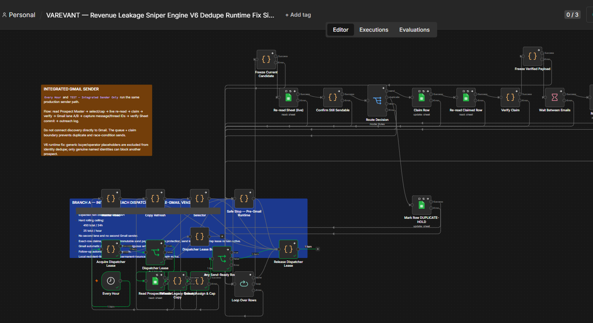
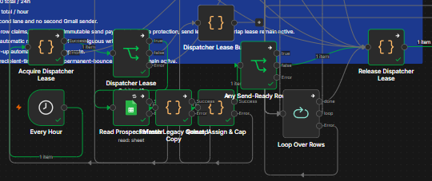

# Selected V6 source → visible execution

**Classification: STRONG MATCH for workflow identity and the visible dispatcher stop path. Exact runtime revision identity is not established.**

Gray boxes cover identity-bearing annotation text. The source annotation's claims about production or preventing races are not verification of those claims.

## Source artifact and revision

The selected original is the uploaded `VAREVANT — Revenue Leakage Sniper Engine V6 Dedupe Runtime Fix Single Gmail 450.json`, archived on **2026-08-07 at 06:13:14 UTC**. Its original SHA-256 is `b9587f65b949b8967dc59a16eb4d88bc1752ff47c1d73d02c2fa1ef6fe9c14fa`.

The public [sanitized snapshot](../workflows/revenue-workflow-v6.sanitized.json) and [source manifest](../source-manifest.json) retain this selected graph: 117 nodes, 60 Code nodes and 153 connections. The snapshot is inspectable at commit [e1e83c6](https://github.com/naraya07pedro-spec/varevant.com/blob/e1e83c635cf05371562054a999695e6542717153/n8n/workflows/revenue-workflow-v6.sanitized.json). Credentials, identities and external resources are substituted; external nodes are disabled for review. This is not a claim that the sanitized snapshot itself was executed.

## Execution artifact and timing

Original screenshot: `0dca6829-1e66-4710-94a8-e0d990f2cd87.png`, archived **2026-08-07 at 03:42:52 UTC**. Its visible desktop clock says **August 7, 2026, 10:40 AM** without a timezone. The upload time and desktop clock are not an execution start timestamp.

This is the **Editor canvas with visible run data**, not a saved Execution History record. Its browser URL workflow identifier was compared privately to the original export's `id`: literal equality was confirmed, and the original image was visually reviewed. That identifier and the private host/project values are removed from the public image and JSON. This private audit result is not independently reproducible from the redacted public files.

The screenshot was archived about 2 hours 30 minutes before the export. The workflow could have been edited during that interval; no runtime `versionId` or embedded `workflowData` is available to exclude that.

## Matching signals

| Signal | Observation | Strength |
| --- | --- | --- |
| Workflow identity | Private screenshot URL workflow ID equals the selected original export's ID. | Stronger than title similarity; identifies the workflow instance, not its saved revision. |
| Title | Visible V6 Dedupe Runtime Fix title agrees with the selected source. | Corroboration only; fix labels are not recovery evidence. |
| Node names and order | Eight nodes on the green branch correspond to source nodes below. | Publicly inspectable, although some labels overlap in the original image. |
| Geometry and branches | Lease above the hourly trigger; reader/refresh/selector below; false decision returns to lease release; true decision enters the unexecuted row loop. | Source positions and edges agree with the visible layout. |
| Adjacent controls | Freeze, reread, claim, Verify Claim and wait nodes appear in the same relative arrangement. | Context; these nodes are gray and are not proven executed. |
| Dates | Same archive date; capture precedes source upload. | Chronology support, not revision equality. |

## Exact visible branch

| Source node | Source position | Outgoing path visible in the screenshot |
| --- | --- | --- |
| Every Hour | [-944, 3312] | Acquire Dispatcher Lease |
| Acquire Dispatcher Lease | [-944, 3152] | Dispatcher Lease Granted? |
| Dispatcher Lease Granted? | [-720, 3152] | True → Read Prospect Master |
| Read Prospect Master | [-720, 3312] | Refresh Legacy Queued Copy |
| Refresh Legacy Queued Copy | [-608, 3312] | Select, Assign & Cap |
| Select, Assign & Cap | [-496, 3312] | Any Send-Ready Rows? |
| Any Send-Ready Rows? | [-384, 3184] | False → Release Dispatcher Lease |
| Release Dispatcher Lease | [-48, 3152] | Green terminal node in this crop |

These source coordinates can be checked directly in the public JSON. The screen is zoomed/panned, so they are not screenshot pixel coordinates.

## What is proven

A historical execution state of the selected workflow instance follows the corresponding source graph's dispatcher no-send branch and reaches lease release. This supports the **workflow/path association**, beyond filename or topology resemblance alone.

## What is not proven

No exact executed source hash, saved execution ID/date, Code-node body equality, activation, continuous operation, Gmail send, claimed-row concurrency protection, or end-to-end success is established. The selected [offline tests](../tests/exported-controls.test.mjs) establish separate synthetic behavior, not this run's payloads.

## Privacy boundary

The October 2 full accessible-filesystem follow-up checked local structured exports, archives, Git history, OCR and video samples. It found no saved historical V6 execution containing this workflow snapshot. The independently [reproduced V19 handler case](reproduced-recovery/README.md) does not upgrade this historical V6 association to EXACT. [Search coverage](SEARCH-AND-GAPS.md) records the accessible scope and Windows access limit.

The raw export and screenshot remain private. Browser tabs, host, workflow/project/account values, sender text and desktop profile are excluded or covered. Crops, hashes and redaction coordinates are recorded in [visual-manifest.json](visual-manifest.json). To raise this to EXACT MATCH, the required saved execution record is specified in [remaining material](SEARCH-AND-GAPS.md).
